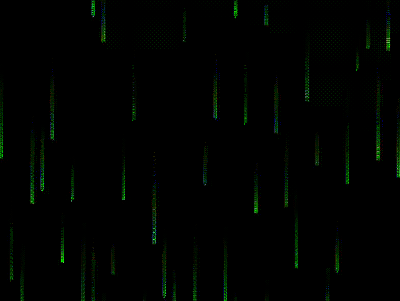

# Matrix Digital Rain

Efeito de chuva digital do Matrix feito com Pygame.



## Rodar
```bash
# Com uv (recomendado)
uv run --with pygame matrix-rain.py

# Ou com pip
pip install pygame
python matrix-rain.py
```

## Features

- Caracteres katakana autênticos do Matrix
- Trail effect com fade gradual
- Velocidades variadas para depth effect
- 30 FPS smooth rendering

## Stack

- Python 3.11+
- Pygame 2.5+

## Como funciona

### Trail Effect
O efeito de rastro característico do Matrix é criado através de uma técnica de **alpha blending**:
```python
# Ao invés de limpar a tela completamente a cada frame:
s = pygame.Surface((WIDTH, HEIGHT))
s.set_alpha(25)  # 25/255 = ~10% opacidade
s.fill((0, 0, 0))
screen.blit(s, (0, 0))
```

A cada frame, sobrepõe-se uma camada preta **semi-transparente** (10% opaca). Isso faz os caracteres antigos irem desaparecendo gradualmente, criando o trail ao invés de sumirem instantaneamente.

### Particle System
Cada coluna de caracteres (`Stream`) funciona como uma partícula independente:

- **Posição inicial**: Acima da tela (`y = -50 a 0`)
- **Velocidade aleatória**: Entre 3-8 pixels/frame para criar depth
- **Reset automático**: Quando sai da tela, volta pro topo
- **20 caracteres por stream**: Cada um com fade gradual

### Color Grading
```python
alpha = max(0, 255 - (i * 12))  # Fade de 255 → 0
color = (0, alpha, 0)            # Verde puro com brilho variável

if i == 0:
    color = (200, 255, 200)      # Primeiro char = verde-esbranquiçado
```

O caractere na ponta é branco-esverdeado brilhante, e os seguintes vão escurecendo progressivamente.

## Conceitos técnicos

- **Frame-based animation**: Game loop a 30 FPS
- **Alpha blending**: Composição de camadas semi-transparentes
- **Object pooling**: Streams são reutilizados ao invés de recriados
- **Bounds checking**: Só renderiza caracteres dentro da tela visível

## Customização

Edite as constantes no código:
- `FONT_SIZE`: tamanho dos caracteres
- `alpha` na Surface: intensidade do trail (quanto menor, mais longo)
- `CHARS`: conjunto de caracteres exibidos
